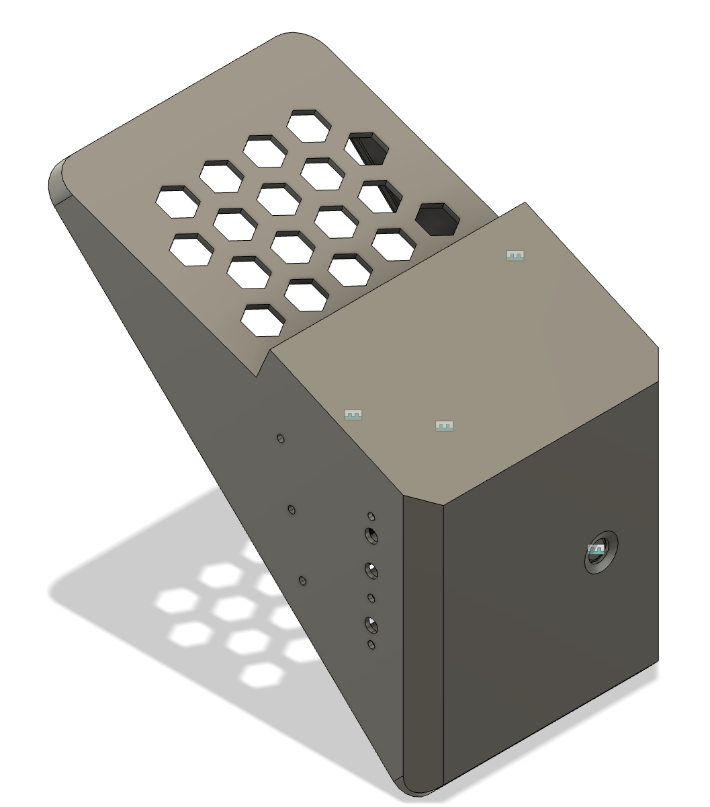
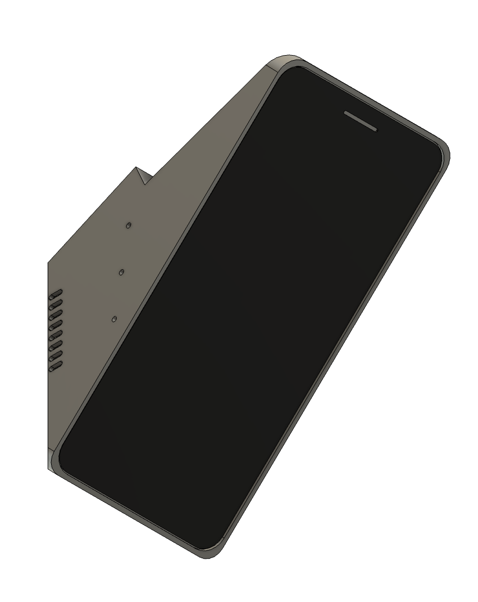

# StealthFreon
Detailed instructions will follow

## Parts
M1.2 x 5mm & M1.7 x 5mm Phillips Micro Screws
[aliexpress](https://de.aliexpress.com/item/1005001348418355.html?spm=a2g0o.productlist.0.0.9d5e140elFf2bj&algo_pvid=5ed15ef4-2082-4051-968a-a99a37476d1c&algo_exp_id=5ed15ef4-2082-4051-968a-a99a37476d1c-6&pdp_ext_f=%7B%22sku_id%22%3A%2212000015772697121%22%7D&pdp_pi=-1%3B4.5%3B-1%3B-1%40salePrice%3BEUR%3Bsearch-mainSearch)

Round Micro Switch  6 x 6 x 5mm
[aliexpress](https://de.aliexpress.com/item/33009771181.html?spm=a2g0o.productlist.0.0.100d2ac3esL5sT&algo_pvid=d229e858-27ac-4016-b16a-91d256866676&algo_exp_id=d229e858-27ac-4016-b16a-91d256866676-0&pdp_ext_f=%7B%22sku_id%22%3A%2267132728428%22%7D&pdp_pi=-1%3B0.46%3B-1%3B-1%40salePrice%3BEUR%3Bsearch-mainSearch)

Noctua NF-A4x10 5V

## Images

