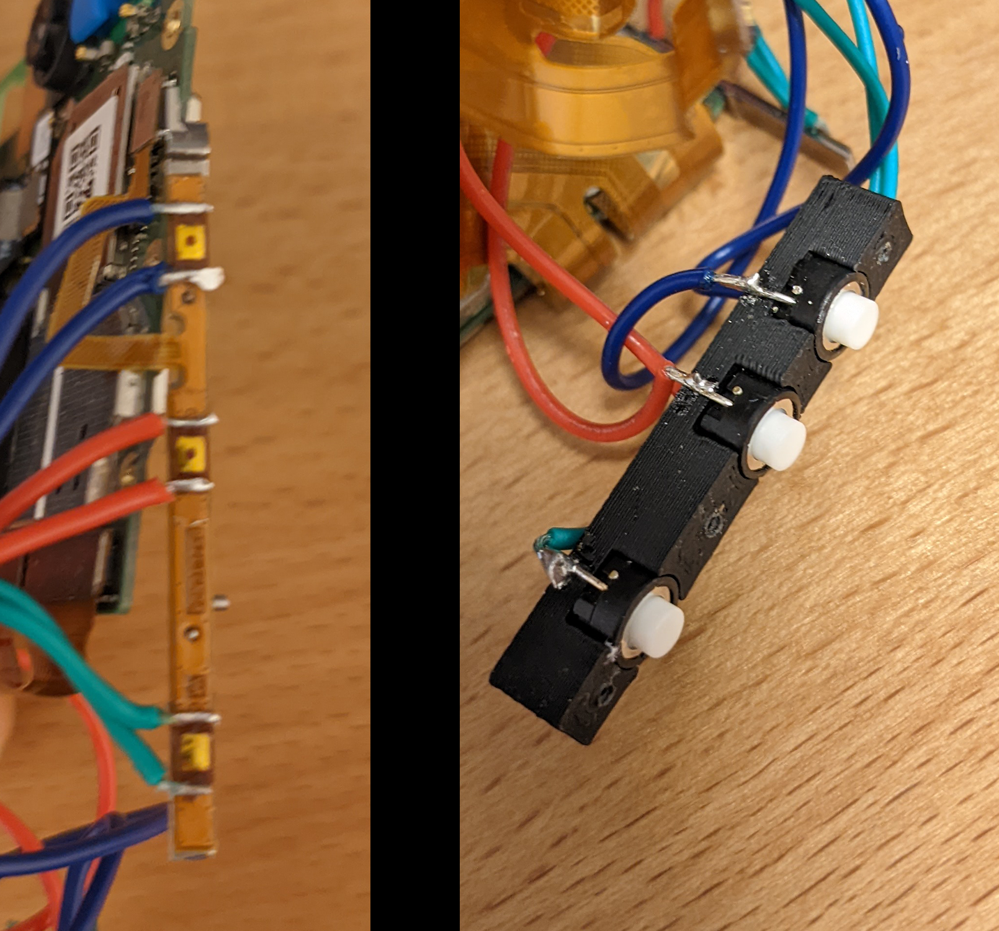

# StealthFreon
****Notice: The driver monitoring does not work anymore after this modification!****

## Parts

<b>Do not buy the LeEco from the seller "China_Product Store" on aliexpress! He is selling X722 as X720</b>

- LeEco Le Pro3 (x720 or X727)

- M1.2 x 5mm & M1.7 x 5mm Phillips Micro Screws
[aliexpress](https://de.aliexpress.com/item/1005001348418355.html)

- Round Micro Switch  6 x 6 x 5mm
[aliexpress](https://de.aliexpress.com/item/33009771181.html)

- SuperCapacitor 2,7V 10F
[aliexpress](https://www.aliexpress.com/item/1005003123401368.html)

- Diode (e.g. P6KE15A)
[aliexpress](https://www.aliexpress.com/item/32407070026.html)

- Noctua NF-A4x10 5V

## Electronics

### Mainboard Pinout

### Batteryless MOD

****<b>Never use a QuickCharge power supply with the batteryless mod! Otherwise it will break the motherboard.   Always use a 5 volt power supply!!</b>****

Two capacitors are used instead of the battery. The capacitors are connected in series to withstand the voltage of 5V.

The capacitors are charged directly via the 5V coming from the ribbon cable.
To prevent the capacitors from being charged via the mainboard, a blocking diode is used.

The fan is also connected directly to the ribbon cable.

### Power and Volume Buttons
To extend the volume and power buttons, 6 cables were soldered directly to the original switches.

## 3D Printing

- Print Settings:
  - Material: ABS
  - Infill: 100% (Case) 25% (other parts)
  - Without Support
  - Layer Height: 0.16
  - Speed: 50mm/s

## Assembly

To disassemble the phone you can follow this [video](https://www.youtube.com/watch?v=Au_gIYhe4k8)

    1. Place the mainboard into the case and screw it with M1.2x5 self-tapping screws.
    2. Screw the charger board into the case with M1.2x5 self-tapping screws. (with the ribbon cable connected)
    3. Connect the ribbon cable to the mainboard
    3. Mount the buttons bracket with M1.7x5 self-tapping screws.
    4. Screw the Noctua fan into the "fan frame" and screw it to the case with 6x M1.7x5 self-tapping screws
    5. Place some double sided tape to the Display. Connect the display to the mainboard and then glue it into the case.
    6. To secure the display even better, two M1.2x5 screws can be used.

## CAD Images

